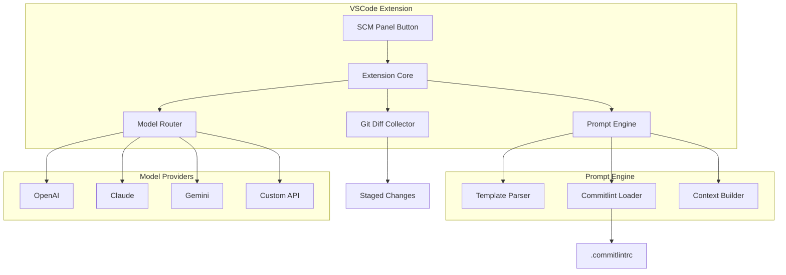

# Git Message Generator - VSCode Extension 实现计划

一个 VSCode 插件，支持自定义 Prompt 和多种 AI 模型，快捷生成符合 Conventional Commits 规范的 commit message。

---

## 核心功能概述

| 功能 | 描述 |
|-----|------|
| **多模型支持** | OpenAI、Claude、Gemini 等，可快速切换（可扩展 Custom API） |
| **自定义 Prompt** | 内置模板 + 支持用户完全自定义 |
| **一键生成** | Source Control 面板按钮触发 |
| **规范适配** | 自动读取 `.commitlintrc` 并适配 Conventional Commits |
| **安全存储** | API Key 使用 VSCode SecretStorage 加密存储 |

---

## 技术架构



---

## 项目结构

```
git_message/
├── package.json              # 插件清单
├── tsconfig.json             # TypeScript 配置
├── src/
│   ├── extension.ts          # 入口文件
│   ├── commands/
│   │   └── generateCommit.ts # 生成命令
│   ├── providers/
│   │   ├── base.ts           # Provider 基类
│   │   ├── openai.ts
│   │   ├── claude.ts
│   │   ├── gemini.ts
│   │   └── custom.ts         # 自定义 API
│   ├── prompt/
│   │   ├── engine.ts         # Prompt 引擎
│   │   ├── templates.ts      # 内置模板
│   │   └── commitlint.ts     # Commitlint 解析
│   ├── git/
│   │   └── diff.ts           # Git 操作
│   ├── ui/
│   │   └── scmButton.ts      # SCM 面板按钮
│   └── utils/
│       ├── config.ts         # 配置管理
│       └── secrets.ts        # API Key 存储
├── resources/
│   └── icons/                # 按钮图标
└── test/
    └── suite/                # 测试文件
```

---

## 详细实现方案

### 1. Model Provider 系统

#### [NEW] [base.ts](file:///Users/tsk/git_message/src/providers/base.ts)

定义统一的 Provider 接口：

```typescript
interface ModelProvider {
  name: string;
  generate(prompt: string): Promise<string>;
  testConnection(): Promise<boolean>;
}

interface ProviderConfig {
  apiKey?: string;
  baseUrl?: string;
  model: string;
  temperature?: number;
  maxTokens?: number;
}
```

#### [NEW] 各模型实现

| 文件 | 支持模型 |
|------|---------|
| `openai.ts` | GPT-4o, GPT-4, GPT-3.5 |
| `claude.ts` | Claude 3.5 Sonnet, Claude 3 Opus |
| `gemini.ts` | Gemini Pro, Gemini Flash |
| `custom.ts` | 任意 OpenAI 兼容 API |

---

### 2. Prompt 模板系统

#### 内置默认模板

```markdown
你是一个专业的 Git Commit Message 生成助手。

## 代码变更
{{diff}}

## 规范要求
{{commitlint_rules}}

## 任务
请根据以上变更生成一条符合规范的 commit message。

格式要求：
- 使用 Conventional Commits 格式: <type>[optional scope]: <description>
- type 可选: feat, fix, docs, style, refactor, perf, test, build, ci, chore
- description 使用{{language}}，简洁明了
- 如有必要，可添加 body 详细说明

只输出 commit message，不要其他解释。
```

#### 支持的变量

| 变量 | 描述 |
|------|------|
| `{{diff}}` | Git staged changes |
| `{{commitlint_rules}}` | 从 .commitlintrc 提取的规则 |
| `{{language}}` | 用户设置的语言（中文/英文） |
| `{{branch}}` | 当前分支名 |
| `{{files}}` | 变更的文件列表 |

---

### 3. Commitlint 集成

#### [NEW] [commitlint.ts](file:///Users/tsk/git_message/src/prompt/commitlint.ts)

```typescript
// 支持的配置文件
const CONFIG_FILES = [
  '.commitlintrc',
  '.commitlintrc.json',
  '.commitlintrc.yaml',
  '.commitlintrc.yml',
  '.commitlintrc.js',
  'commitlint.config.js'
];

// 解析后注入 Prompt 的规则摘要
interface CommitlintRules {
  types: string[];           // 允许的 type
  scopes?: string[];         // 允许的 scope
  maxHeaderLength?: number;  // 标题最大长度
  // ... 其他规则
}
```

---

### 4. SCM 面板集成

#### [NEW] [scmButton.ts](file:///Users/tsk/git_message/src/ui/scmButton.ts)

在 Source Control 面板添加按钮，使用 VSCode 的 `scm/title` 菜单贡献点：

```json
// package.json contributes
{
  "menus": {
    "scm/title": [
      {
        "command": "gitMessage.generate",
        "group": "navigation",
        "when": "scmProvider == git"
      }
    ]
  }
}
```

---

### 5. 配置方案

#### 用户设置 (settings.json)

```json
{
  "gitMessage.defaultProvider": "openai",
  "gitMessage.language": "en",
  "gitMessage.languageFallback": "zh-CN",
  "gitMessage.customPrompt": "",
  "gitMessage.providers": {
    "openai": {
      "model": "gpt-4o",
      "baseUrl": "https://api.openai.com/v1"
    },
    "claude": {
      "model": "claude-3-5-sonnet-20241022"
    }
  }
}
```

#### API Key 存储

使用 VSCode `SecretStorage` API 安全存储：

```typescript
// 存储
await context.secrets.store('gitMessage.openai.apiKey', key);
// 读取
const key = await context.secrets.get('gitMessage.openai.apiKey');
```

---

## User Review Required

> [!IMPORTANT]
> **语言支持**
> 默认生成英文 commit message，并支持一键切换中英文。

> [!NOTE]
> **用户确认**：生成后直接填入 commit message 输入框，不需要预览确认或多候选选择。

---

## 实现顺序

| 阶段 | 内容 | 预计工作量 |
|-----|------|-----------|
| Phase 1 | 项目初始化 + 核心框架 | 基础 |
| Phase 2 | OpenAI Provider + Provider Router | 核心 |
| Phase 3 | Prompt 引擎 + Commitlint | 核心 |
| Phase 4 | SCM 按钮 + 生成流程 | 核心 |
| Phase 5 | 配置 UI + API Key 管理 | 完善 |
| Phase 6 | Claude/Gemini/Custom 扩展 | 扩展 |

---

## Verification Plan

### 本地开发测试

```bash
# 1. 安装依赖
npm install

# 2. 编译
npm run compile

# 3. 启动 Extension Development Host
# 按 F5 或运行 "Run Extension" 调试配置
```

### 功能验证

1. **Provider 切换测试**
   - 配置 OpenAI API Key
   - 生成 commit message
   - 切换到其他 Provider（如 Claude）
   - 再次生成，验证切换成功（或提示缺少对应 API Key）

2. **Commitlint 集成测试**
   - 在项目中创建 `.commitlintrc.json`
   - 验证生成的 message 符合配置的规则

3. **SCM 按钮测试**
   - 打开有 Git 仓库的项目
   - 在 Source Control 面板找到生成按钮
   - Stage 一些文件后点击按钮
   - 验证 commit message 被填入输入框

### 手动测试清单

- [ ] 安装插件后，命令面板能找到 "Generate Commit Message"
- [ ] SCM 面板显示生成按钮
- [ ] 点击按钮能正确调用 AI 并生成 message
- [ ] API Key 配置后重启 VSCode 仍然存在
- [ ] 切换 Provider 后下次生成使用新 Provider
